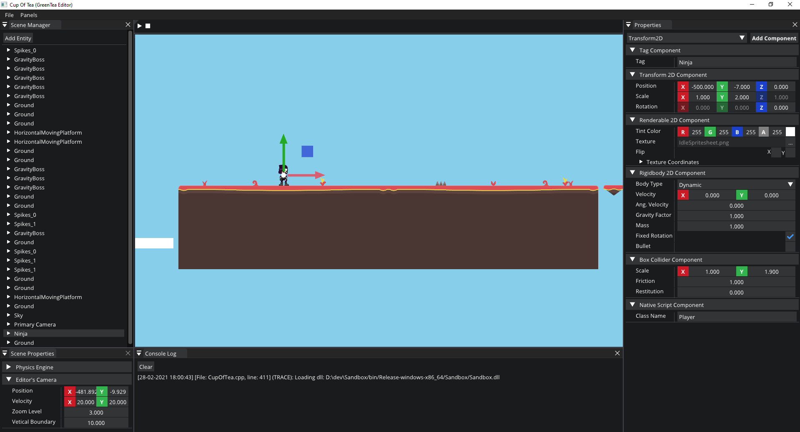

# Green Tea Engine

  Green Tea engine is a 2D Game Engine that is heavily inspired by [Hazel](https://github.com/TheCherno/Hazel) and [Cherno's](https://thecherno.com/) [Game Engine Series](https://youtube.com/playlist?list=PLlrATfBNZ98dC-V-N3m0Go4deliWHPFwT). The Engine currently being developed only by me, in my own free time, with the only purpose of helping me understand better how game engines as well as game development works. I will **not** recommend using this Engine for final products. Instead I will advice you to use [Hazel](https://github.com/TheCherno/Hazel) that is being be used checked by a lot more people, or one of the well established game engines.

## Sandbox

  Green Tea engine comes with a folder called Sandbox where you can find an example project that you can use as a reference. Please read the wiki page to learn how to setup the project correctly.

  

## Third Party Libraries

  * _[premake5](https://github.com/premake/premake-core) Is used for project generation both by the engine as well it's projects._
  * _[SDL2](https://www.libsdl.org/) Is used for window creation and event polling._
  * _[glm](https://github.com/g-truc/glm) Is used as a math library._
  * _[GLEW](http://glew.sourceforge.net/) Is used for loading OpenGL functions._
  * _[stb](https://github.com/nothings/stb) Is used for reading image files._
  * _[cereal](https://github.com/USCiLab/cereal) Is used for Scene serialization._
  * _[entt](https://github.com/skypjack/entt) As an entity-component-system._
  * _[box2d](https://box2d.org/) As a physics engine._
  * _[Dear ImGui](https://github.com/ocornut/imgui) Is used for all UI elements of the engine's editor._
  * _[ImGuizmo](https://github.com/CedricGuillemet/ImGuizmo) Is used for Guizmo controls._
  * _[IconFontCppHeaders](https://github.com/juliettef/IconFontCppHeaders) For using Icon fonts_

## Assets

The following third party assets are being used by the editor:

  * _[Open Sans](https://fonts.google.com/specimen/Open+Sans?query=open+s&preview.text_type=custom) Font designed by Steve Matteson._
  * _[Font Awesome 4](https://github.com/FortAwesome/Font-Awesome/tree/fa-4) Use for the Icons of the editor._

Assets used by Sandbox project:

* _[Abstract Platformer](https://www.kenney.nl/assets/abstract-platformer) by Kenney Vleugels ([Kenney.nl](https://www.kenney.nl/))._
* _[Animated Ninja](https://www.gameart2d.com/ninja-adventure---free-sprites.html) by Game Art 2D._

## Contributing
  * _For reporting a bug please open an issue describing the bug as well a way to recreate it._
  * _If you want to contribute or suggest a new feature open an issue describing what you want._
  * _Feel free to work to any of the opened issues for a bug and make a pull request._
